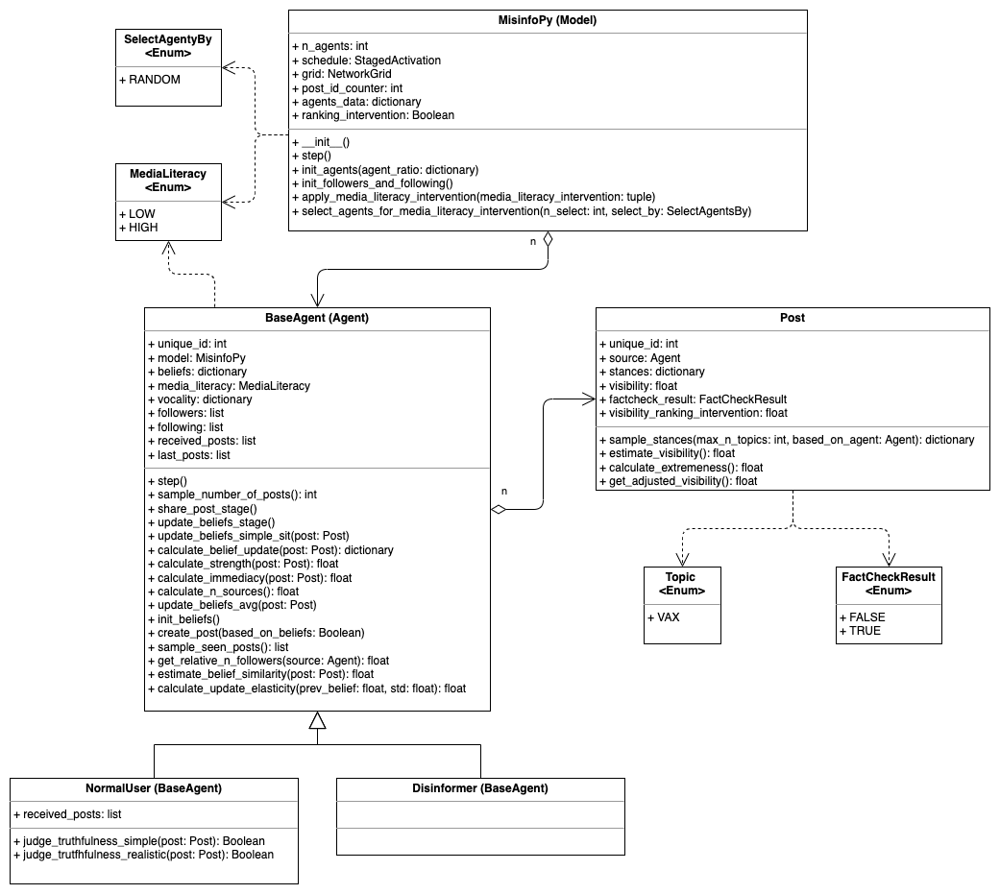
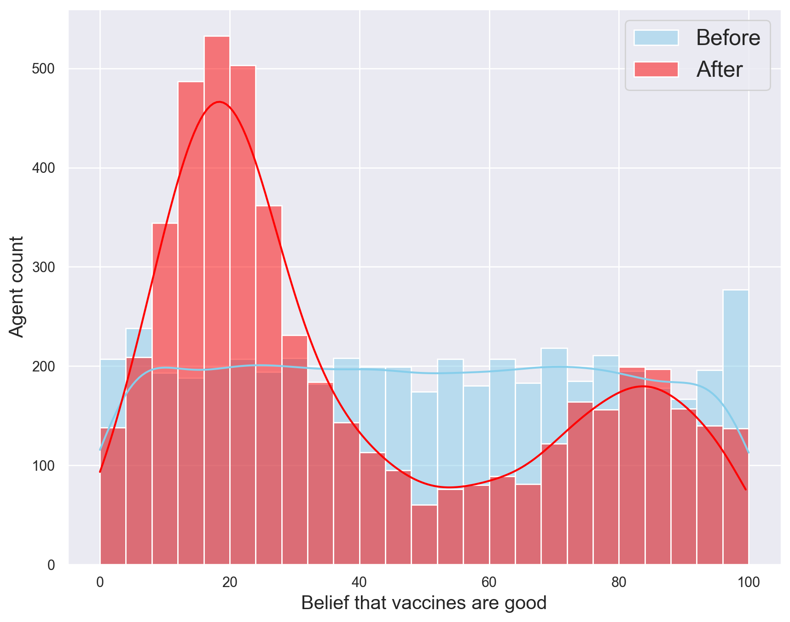

# The MisinfoPy Model

The goal of this project was to create an extendable agent-based model of misinformation spread on social media. The MisinfoPy model has been implemented in Python (3.9) and based on the agent-based libray [Mesa](https://mesa.readthedocs.io/en/master/#:~:text=Mesa%20is%20an%20Apache2%20licensed,or%20ABM)%20framework%20in%20Python.&text=Its%20goal%20is%20to%20be,analyzed%20in%20an%20IPython%20notebook.). 


## Authored by Felicitas Reddel


## Table of Contents
1. [General Remarks](#1-general-remarks)
2. [Repository Structure](#2-repository-structure)
3. [The Model](#3-the-model)
   1. [UML Diagram](#31-uml-class-diagram)
   2. [Parameters](#32-model-parameters)
   3. [Results](#33-results)

    

## 1. General Remarks

This project has been developed within an internship at the **TPM AI Lab** at the **TU Delft** and the Dutch **Ministry of the Interior and Kingdom Relations** during the academic year 2021/22 between quarter 1 and quarter 2.


---
## 2. Repository Structure

```
./internship/
├── images
├── notebooks
│   ├── main.ipynb                        
│   ├── Visualization_KPI_1.ipynb         # Visualize KPI 1
│   ├── Visualization_KPI_2.ipynb         # Visualize KPI 2
│   └── Viz_Belief_Distributions.ipynb    # Visualize belief distributions (before and after)
├── results                               # Contains results (csv + png)
│   └── images                            # Contains figures as png files
├── agents.py                             # Contains different agent types
├── enums.py                              # Contains custom-made enumerations
├── experiments.py                        # Contains functions and main code to run experiments
├── main.py                               # Run a simulation of the MisinfoPy model
├── misinfo_model.py                      # Contains the model
├── posts.py                              # Contains Post class
├── README.md          
├── report.pdf                            # Contains all information about the model, its assumptions, etc.
└── visualization.py                      # Contains functions to visualize belief distributions      
```

The important modules for the model are `misinfo_model.py`, `agents.py`, `posts.py`, and `enums`.

---
## 3. The Model

### 3.1 UML Class diagram 

Figure 1 shows the UML class diagram of this project. More explanation can be found in the report.



<figcaption ><b>Fig.1 - UML Class Diagram of the MisinfoPy Model</b></figcaption>


### 3.2 Model Parameters

Table 1 shows the main parameters that can be passed to the initialization method of the model.

| Parameter                   | Data Type  | Default                                                  | Definition                                                     |
|-----------------------------|------------|----------------------------------------------------------|----------------------------------------------------------------|
| n_agents                    | int        | 1000                                                     | total number of agents in network                                    |
| agent_ratio                 | dictionary | {NormalUser.__name__: 0.9,<br> Disinformer.__name__: 0.1} | distribution of agents by agent types                                    |
| n_edges                     | int        | 2                                                        | number of edges for Barabasi Albert network                    |
| visualize                   | Boolean    | False                                                    | whether to run a simulation w/ or w/o an animation             |
| media_literacy_intervention | tuple      | (0.0, SelectAgentsBy.RANDOM)                             | what part of the population should get a higher media literacy |
| ranking_intervention        | Boolean    | False                                                    | whether disinformation posts get punished via down-ranking     |
<figcaption ><b>Tab.1 - Main Parameters of the MisinfoPy Model</b></figcaption>


### 3.3 Results

The most important KPI is the belief distribution within the network. Figure 2 shows an example for such a belief distribution. The blue bars represent the belief distribution at initialization of the model. The red bars represent the belief distribution at the end of the simulation (the default is after 60 days).



<figcaption ><b>Fig.2 - Example belief distribution of 1000 agents, before and after a model run of 60 days.</b></figcaption>

First the agents are randomly and rather uniformly distributed (blue). When enough time passes (e.g., 60 days), we can observe that without any interventions, some polarization is emerging. But the mode with low belief-values is substantially stronger.


